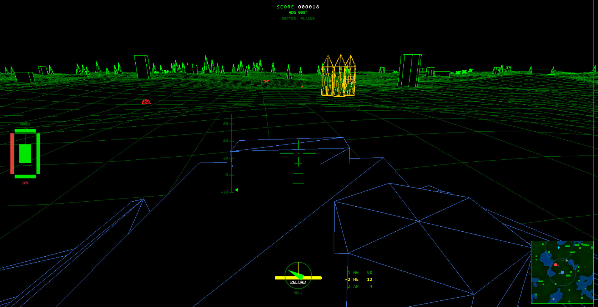
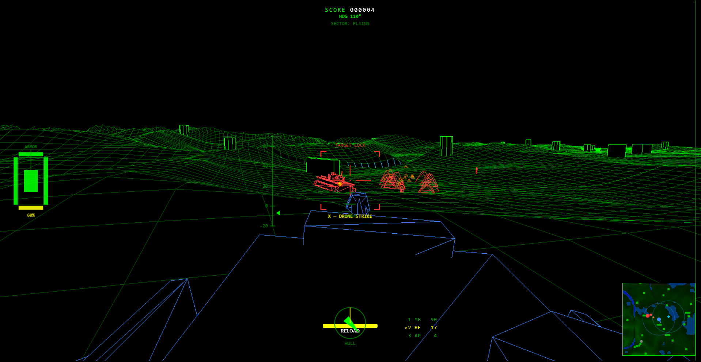
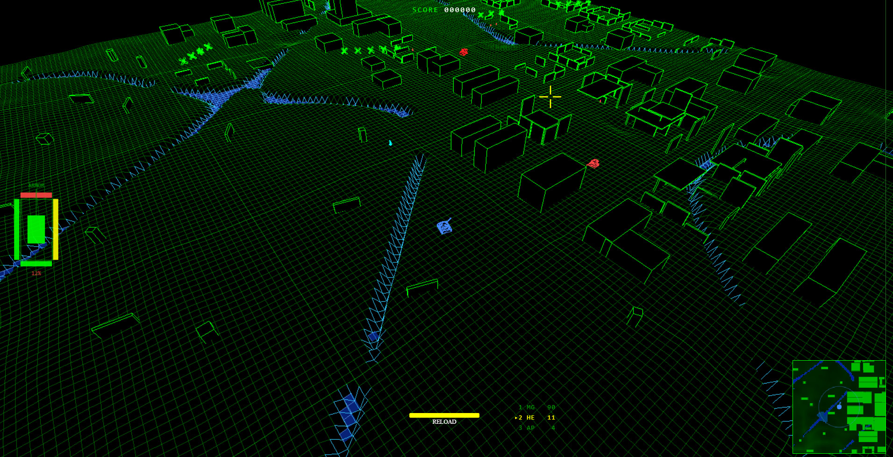

# Gridnought

A wireframe vector tank-combat game — glowing green terrain, neon enemies, and a
first-person gunsight, in the spirit of the arcade vector classics. Drive a tank or
pilot a two-legged mech across endless procedural battlefields, fight your way past
scaling enemy forces, and survive long enough to meet the **Gridnought** — the heavy
walker boss that comes hunting once you pass 100 points.

Built with **Three.js** and **React**, and packaged as a native Windows desktop app
with **Tauri**.



## Features

- **Wireframe vector rendering** — everything is drawn as glowing edges over solid
  black, for a clean vector-display look.
- **Endless procedural terrain** — chunked infinite world with distinct biome pockets
  (plains, cities, ravines with water and bridges).
- **Two player vehicles**
  - **Tank** — classic hull-plus-turret with a stabilised gunsight.
  - **Mech** — a tall two-legged walker with an open-front cockpit and a ball-joint
    head that can step into and over ravines; the view sways naturally with each stride.
- **Three ammo types** — Machine Gun, HE shell, and AP shell, switchable on the fly.
- **Drone support** — a recon drone spots enemies for your minimap and can be retasked
  or called in for a strike.
- **A range of enemies** — enemy tanks, APCs, turret emplacements, minelayers, transport
  aircraft, and infantry that garrison ruined buildings — with the threat scaling as your
  score climbs.
- **The Gridnought** — heavy assault units the game is named for, culminating in a
  six-legged walker **level boss** that appears past 100 points.
- **First- and third-person** views, armour-damage panel, and a live minimap.




## Controls

| Input | Action |
| --- | --- |
| `W` / `S` | Drive forward / back |
| `A` / `D` | Turn hull |
| Mouse | Aim turret |
| Left click | Fire |
| `1` / `2` / `3` | Select ammo (MG / HE / AP) |
| `,` / `.` | Barrel elevation |
| `X` | Drone strike |
| `R` | Retask drone |
| `P` | Toggle first / third person |
| `Q` / `E` | Orbit camera |
| `Esc` | Pause menu |

## Getting started

Requires [Node.js](https://nodejs.org/) (18+). To also build the desktop app, you need
the [Tauri prerequisites](https://v2.tauri.app/start/prerequisites/) (Rust toolchain and,
on Windows, the WebView2 runtime + MSVC build tools).

```bash
# install dependencies
npm install

# run the game in the browser with hot reload (http://localhost:5173)
npm run dev

# run inside the native Tauri desktop shell
npm run tauri:dev
```

### Building

```bash
# build the web bundle
npm run build

# build the Windows desktop installer (.msi + .exe / NSIS)
npm run tauri:build
```

The installer is produced under Tauri's `target/release/bundle/` directory.

## Tech stack

- **[Three.js](https://threejs.org/)** — 3D rendering
- **[React](https://react.dev/)** — menus and HUD/UI overlays
- **[Vite](https://vitejs.dev/)** — dev server and bundler
- **[Tauri 2](https://v2.tauri.app/)** — native desktop packaging (Windows)

## Project layout

```
src/
  entities/    tanks, mech, enemies (incl. Gridnought), projectiles, effects
  terrain/     chunked terrain, biomes, buildings, obstacles
  ai/          enemy AI controllers
  camera/      first/third-person camera control
  physics/     collision and movement validation
  rendering/   React menus, HUD, minimap, and the "Area X" test range
  game/        GameManager — the main game loop and orchestration
  utils/       constants and shared helpers
src-tauri/     Tauri desktop shell (Rust) and app icons
```

> **Area X** is an in-game test range that showcases every entity model — handy for
> inspecting units and trying the mech via the "Start as Mech" button.

## License

Released under the [MIT License](LICENSE).
